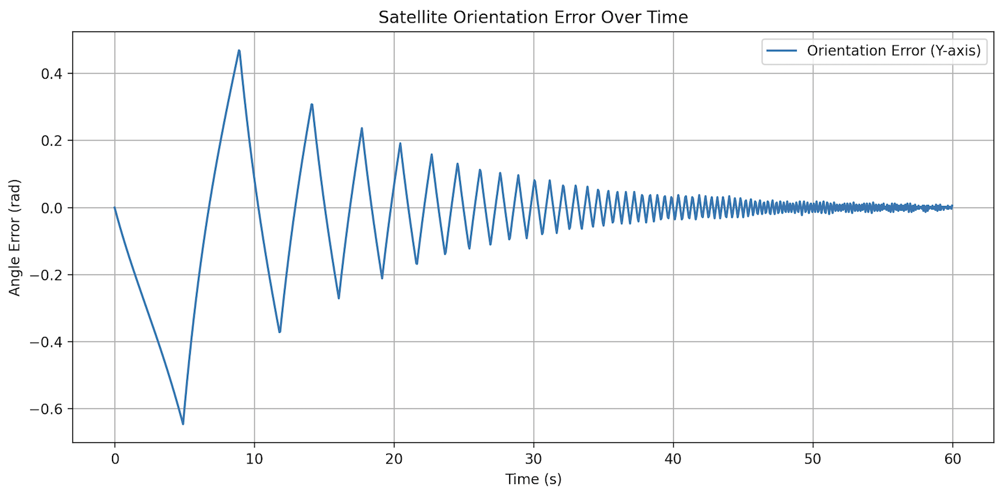
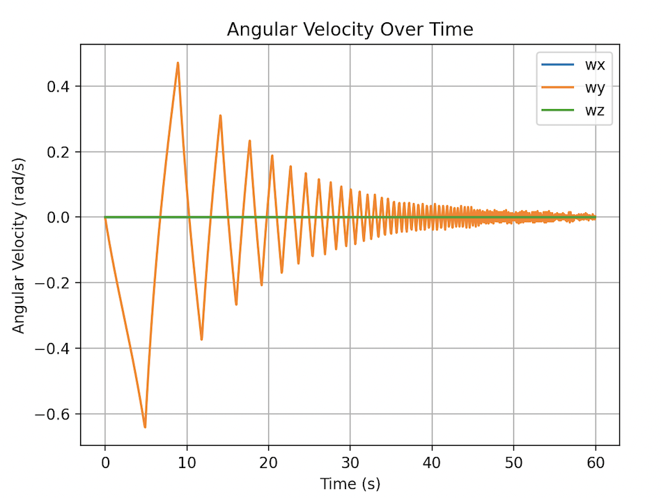
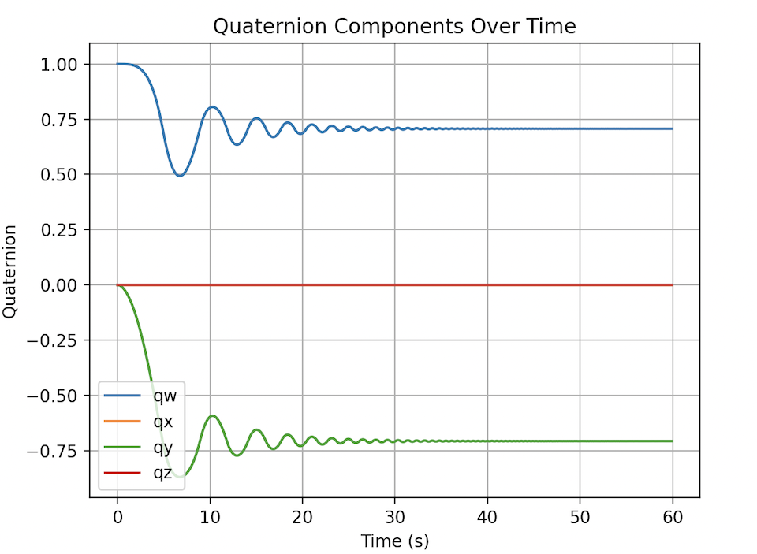

# Satellite Attitude Controller

This project simulates a satellite's attitude stabilization using a Linear Quadratic Regulator (LQR). The controller commands torques to reaction wheels to align the satellite's orientation with a target quaternion. Orientation is represented and integrated using quaternions for stability and singularity-free behavior.

---

## Visualizations

### Orientation Tracking
<p align="center">
  
</p>

### Angular Velocity Convergence
<p align="center">
  
</p>

### Component-Wise Orientation
<p align="center">
  
</p>
---

## Overview

- **State Representation:**  
  The state vector is `[ω; θ_err]` where:
  - `ω` is the 3D angular velocity vector
  - `θ_err` is a 3D vector derived from the angle-axis representation of the quaternion error (target ⊗ current⁻¹)

- **Dynamics:**  
  Uses **Euler’s rotational equations** for rigid body motion, integrating the quaternion orientation over time.

- **Controller:**  
  An infinite-horizon **LQR controller** is computed from a linearized 6D state-space model:
  - Linearized about the identity orientation
  - Incorporates damping
  - Penalizes state deviation and control effort via matrices `Q` and `R`

---

## Simulation Output

- The system logs:
  - Time
  - Orientation quaternion `[w, x, y, z]`
  - Angular velocity `[ωx, ωy, ωz]`
  - Commanded torque
  - Error state

## 📄 Reference

The controller and dynamics formulation are inspired by:

**Liu, R., & Zhang, G. (2015).**  
*Attitude control of spacecraft using quaternion feedback and LQR method.*  
IFAC-PapersOnLine, 48(1), 775–780.  
[https://doi.org/10.1016/j.ifacol.2015.05.159](https://doi.org/10.1016/j.ifacol.2015.05.159)

---

## How to Run

1. **Build the project** (CMake):
   ```bash
   mkdir build && cd build
   cmake ..
   make
   ./SatelliteController
